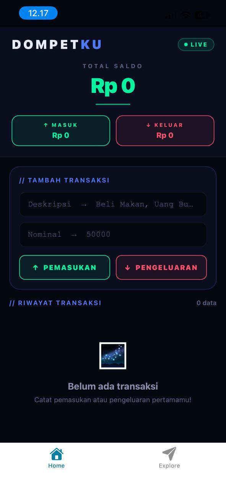
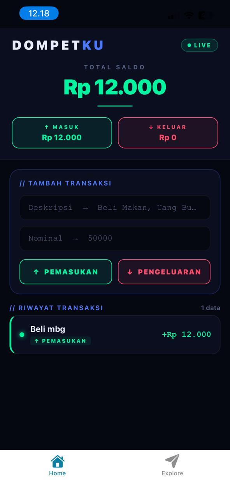
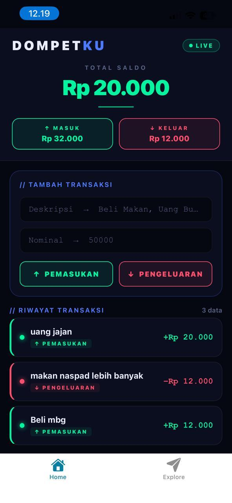

# 💳 DompetKu — Expense Tracker App

> **UTS Project | Pemrograman Mobile | React Native + Expo**


---

## 📱 Screenshot Aplikasi

> _(Ganti bagian ini dengan screenshot kamu dari Expo Go)_

|             Tampilan Utama              |              Tambah Transaksi              |              Riwayat Penuh              |
| :-------------------------------------: | :----------------------------------------: | :-------------------------------------: |
|  |  |  |

---

## 📜 Deskripsi Proyek

**DompetKu** adalah aplikasi pencatat transaksi keuangan pribadi (_Expense Tracker_) yang dibangun menggunakan **React Native** dan **Expo**.  
Aplikasi ini memungkinkan pengguna mencatat pemasukan dan pengeluaran sehari-hari, serta melihat total saldo secara _real-time_.

---

## ✅ Fitur yang Diimplementasikan

| No  | Fitur                                                                 | Status |
| --- | --------------------------------------------------------------------- | ------ |
| 1   | **Header Saldo Real-time** — saldo dihitung otomatis (masuk − keluar) | ✅     |
| 2   | **Form Input** — Deskripsi + Nominal dengan `keyboardType="numeric"`  | ✅     |
| 3   | **2 Tombol** — "Pemasukan" (hijau neon) & "Pengeluaran" (merah neon)  | ✅     |
| 4   | **FlatList** — riwayat transaksi dengan `keyExtractor` yang benar     | ✅     |
| 5   | **Conditional Styling** — nominal hijau = masuk, merah = keluar       | ✅     |
| 6   | **Validasi Input** — cegah input kosong & nominal tidak valid         | ✅     |
| 7   | **KeyboardAvoidingView** — form tidak tertutup keyboard               | ✅     |
| 8   | **Empty State** — pesan saat belum ada transaksi                      | ✅     |

---

## 🧠 Logika State

```javascript
// Array state untuk menyimpan semua transaksi
const [transaksi, setTransaksi] = useState([
  { id: "1", ket: "Uang Saku", nominal: 100000, tipe: "masuk" },
  { id: "2", ket: "Beli Cilok", nominal: 10000, tipe: "keluar" },
]);

// Hitung saldo dengan .reduce()
// Kalau 'masuk' → tambah | kalau 'keluar' → kurang
const totalSaldo = transaksi.reduce((acc, t) => {
  return t.tipe === "masuk" ? acc + t.nominal : acc - t.nominal;
}, 0);
```

---

## 🎨 Design Theme

Tema **Cyberpunk / Neon-Dark** dengan palet warna:

- Background: `#050711` (deep space dark)
- Neon Green: `#00f5a0` — untuk pemasukan
- Neon Red: `#ff4d6d` — untuk pengeluaran
- Neon Blue: `#4d79ff` — untuk aksen UI

---

## 🚀 Cara Menjalankan

```bash
# 1. Clone repo ini
git clone https://github.com/pras177/UTS.git
cd UTS

# 2. Install dependencies
npm install

# 3. Jalankan Expo
npx expo start

# 4. Scan QR code di Expo Go (Android / iOS)
```

**Requirements:**

- Node.js ≥ 18
- Expo Go app di smartphone
- `npm install` atau `yarn install`

---

## 📁 Struktur File

```
dompetku/
├── App.js          ← Seluruh kode aplikasi
├── app.json        ← Konfigurasi Expo
├── package.json
├── screenshots/    ← Screenshot bukti aplikasi berjalan
│   ├── home.png
│   ├── form.png
│   └── list.png
└── README.md
```

---

## 👤 Informasi Mahasiswa

| Field           | Detail                   |
| --------------- | ------------------------ |
| **Nama**        | _(Prasetya Amal Dinata)_ |
| **NIM**         | _(243303621248)_         |
| **Kelas**       | _(4 pagi A)_             |
| **Mata Kuliah** | Pemrograman Mobile       |

---
